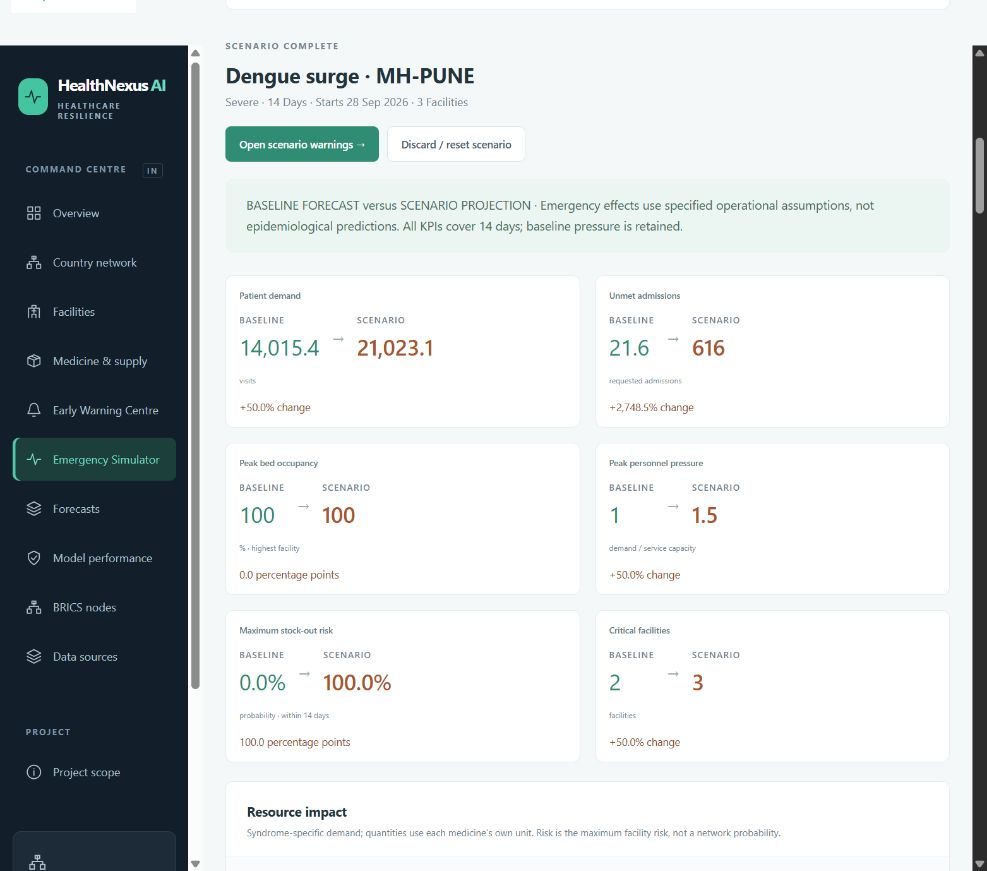

# HealthNexus AI

**Federated Intelligence for Healthcare Resilience**

A real-data-backed healthcare resilience prototype combining public health statistics with calibrated operational simulation. The configured BRICS scope is India, Brazil, Russia, China and South Africa. India remains the detailed showcase: all 36 states/UTs, 69 illustrative districts and 207 fictional facilities. Each other country has two representative regions and six fictional facilities. These five nodes are the hackathon scope, not an exhaustive list of current BRICS members.



## Working through Phase 4

The **Emergency Simulator** now supports dengue surge, delivery delay, staff shortage and facility disruption, with immutable baselines, paired projections, inventory/bed/workforce propagation and an **Early Warning Centre**. [Phase 4 report](docs/phase4-report.md) · [Live API verification](docs/evaluation/phase4-smoke.json).

Forecasting includes 540-day causal histories, country-local trained models, three mandatory baselines, chronological selection/calibration/test periods, empirical 80%/95% intervals and calculated stock-out intelligence. Open **Forecasts** and **Model performance**, or the facility **Predictive Outlook**. [Phase 3 report](docs/phase3-report.md) · [Actual model comparisons](docs/phase3-results.md) · [Model card](docs/model-card.md).

- Angular standalone command centre and FastAPI API, retaining India navigation and facility details.
- Two real public-source adapters: MoHFW/PIB Health Dynamics of India 2022–23 (13 national statistics) and WHO GHO (20 bed/workforce observations across five countries).
- Attributed raw caches, validated normalized observations, and separate generated operations.
- Public statistics calibrate synthetic capacity, catchment and staffing. Demand drives medicine requests, admissions and stock ledgers.
- Country selection, BRICS node view and Data Sources page expose coverage, reference years and provenance.
- Local offline operation, optional Firestore adapter, Docker scaffolding and a regression/forecasting test suite.

**Facility-level operational values are simulated, not real-world live feeds.** Forecasts are evaluated on this simulator, not validated against real healthcare operations. Warnings use deterministic rules and model-derived conditional risks. Emergency shocks are externally specified operational assumptions, not epidemiological predictions. OR-Tools, Gemini and federated training remain later milestones. Physical redistribution is designed to stay within each nation; future federation exchanges model updates only.

## Run locally — Windows PowerShell

Requirements: Python 3.11+ (tested with 3.13), Node.js 22.12+ in the Node 22 line, npm.

From the repository root:

```powershell
python -m venv .venv
.\.venv\Scripts\python.exe -m pip install -r backend\requirements.txt
.\.venv\Scripts\python.exe scripts\import_official_data.py
.\.venv\Scripts\python.exe scripts\forecast.py generate --country all --days 540 --seed 42 --as-of 2026-09-27
.\.venv\Scripts\python.exe scripts\forecast.py build --country all
.\.venv\Scripts\python.exe scripts\forecast.py train --country all
.\.venv\Scripts\python.exe scripts\forecast.py evaluate --country all
.\.venv\Scripts\python.exe -m uvicorn app.main:app --app-dir backend --host 127.0.0.1 --port 8000
```

In a second terminal, from the repository root:

```powershell
cd frontend
npm ci
npm start
```

Open [the app](http://127.0.0.1:4200) or [API documentation](http://127.0.0.1:8000/docs). The Angular development proxy forwards `/api` to port 8000. Local mode needs no credentials or `.env`; `.env.example` documents optional configuration. On macOS/Linux use `.venv/bin/python`.

The import command above is offline. To refresh from the actual public endpoints:

```powershell
.\.venv\Scripts\python.exe scripts\import_official_data.py --refresh
# Or select one adapter: --source india_hdi or --source who_gho
```

Regenerate history, rebuild training tables and retrain after updating sources; restart the backend afterward. Snapshots retain their explicit date and frozen calibration inputs. Missing public caches produce visible assumptions; invalid caches fail validation. Forecasting models are never trained at API startup. Missing/stale models return an explicit unavailable state. The older `scripts/generate_data.py` still creates short operational samples, but overwriting a trained snapshot with one makes its forecasts stale; use the Phase 3 history workflow for forecasting.

## Verify

```powershell
.\.venv\Scripts\python.exe -m pytest backend -q
.\.venv\Scripts\python.exe -m compileall -q backend\app scripts
cd frontend
npm run build
npx tsc --noEmit -p tsconfig.app.json
```

See [validation](docs/validation.md), [Phase 4 report](docs/phase4-report.md), [Phase 3 report](docs/phase3-report.md), and the historical [Phase 2 report](docs/phase2-report.md).

## Storage and deployment

`HEALTHNEXUS_STORAGE=local` is the default. `HEALTHNEXUS_CORS_ORIGINS` controls allowed local origins. Firestore requires `HEALTHNEXUS_STORAGE=firestore`, `GOOGLE_CLOUD_PROJECT` and server-side application credentials. It fails clearly if unavailable. `GEMINI_API_KEY` and `GEMINI_MODEL` are reserved and unused.

India's existing `data/generated/network.json` path remains compatible. Other nodes use `data/generated/nodes/<country>/network.json`. Legacy schema-1 India snapshots remain readable and are explicitly identified as uncalibrated synthetic data. New schema-2 snapshots include lineage.

Firestore stores `country_nodes/<code>` subcollections for metadata, regions, districts, facilities and alerts; legacy India collections remain a read fallback. To explicitly seed a test project:

```powershell
.\.venv\Scripts\python.exe scripts\seed_firestore.py --project YOUR_TEST_PROJECT --country IN --confirm-synthetic-upload
```

This creates/overwrites matching sample IDs and does not remove unrelated documents. Cloud execution has not been validated against a live project. Country partitioning is logical, not an access-control boundary. Authentication and production isolation remain future work.

`docker compose up --build` starts the container scaffold, including public caches, with the frontend at port 4200. Docker runtime deployment has not been verified here. Firebase Hosting and Cloud Run are planned; nothing is published automatically.

For forecasts in containers, first run the host generation/training commands. Compose mounts `data/generated` and `artifacts/models` read-only into the backend. If models are absent, forecasting is explicitly unavailable while the original dashboard remains runnable. Do not import joblib artifacts from untrusted sources.

## Repository and sources

| Path | Purpose |
| --- | --- |
| `backend/app/data_ingestion/` | Public-source adapters, caching and normalization |
| `backend/app/simulation/` | Public calibration and causal synthetic generator |
| `backend/app/forecasting/` | Temporal features, training, evaluation, uncertainty, stock projections and typed API |
| `artifacts/models/` | Gitignored country-local models, metrics and integrity manifests |
| `data/official/` | Small attributed raw extracts |
| `data/normalized/` | Validated public observations |
| `data/generated/` | Gitignored fictional operations by country |
| `data/metadata/` | India hierarchy and representative foreign regions |
| `frontend/` | Country-aware command centre and source explorer |
| `docs/` | Scope, architecture, sources, model assumptions, API and demo |

Read [data sources and usage terms](docs/data-sources.md), [model assumptions](docs/model-card.md), [scope](docs/scope.md) and [the master build prompt](docs/master-build-prompt.md). The system contains no patient or employee identities. It is not a clinical decision system. Public material retains its source terms; the MIT license applies to project code, not third-party datasets. WHO does not endorse this project.
