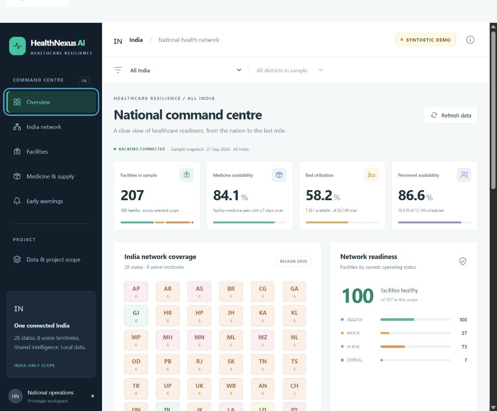

# HealthNexus AI

**Federated Intelligence for Healthcare Resilience — India**

An India-only national healthcare resilience prototype. The product scope covers every Indian state and union territory, with national → state/UT → district → facility navigation. Redistribution and future federated learning stay within India.



## Working milestone

Phase 1 is implemented, with a synthetic network to make the foundation useful:

- Angular 20 standalone frontend, Router, signals, SCSS and responsive command-centre layout.
- FastAPI backend, Pydantic models, OpenAPI documentation, CORS configuration and validated filters.
- 207 fictional facilities across all 28 states and 8 union territories, using 69 illustrative districts.
- National/regional resource summaries, facility search and pagination, medicine balances, beds, attendance, 28 days of patient demand and deterministic resource alerts.
- Credential-free local repository and an optional server-side Firestore repository.
- Reproducible generation and tests for balances, geographic scoping, aggregation, thresholds and error handling.

**This is synthetic sample coverage, not all Indian districts or real healthcare facilities.** No government operational systems are connected. The generator uses explicit assumptions, not calibrated government health statistics. State/UT identifiers are internal prototype codes, not LGD codes.

ML forecasting, emergency simulation, OR-Tools redistribution, Gemini and state-level FedAvg remain later milestones. Current alerts are threshold calculations, not AI predictions. See [scope](docs/scope.md) and the revised [master build prompt](docs/master-build-prompt.md).

## Run locally (Windows PowerShell)

Requirements: Node.js 22.12+ in the Node 22 line, npm, Python 3.11+ (tested with 3.13).

From the repository root:

```powershell
python -m venv .venv
.\.venv\Scripts\python.exe -m pip install -r backend\requirements.txt
Copy-Item .env.example .env
.\.venv\Scripts\python.exe scripts\generate_data.py --seed 42 --as-of 2026-09-27
.\.venv\Scripts\python.exe -m uvicorn app.main:app --app-dir backend --host 127.0.0.1 --port 8000
```

In a second terminal:

```powershell
cd frontend
npm ci
npm start
```

Open **http://127.0.0.1:4200**. API docs: **http://127.0.0.1:8000/docs**. Health: **http://127.0.0.1:8000/api/health**.

The Angular development proxy forwards `/api/**` to port 8000; frontend source contains no cloud secrets. `.env` is optional for local mode. If no generated snapshot exists, the backend creates the deterministic network in memory. A saved snapshot keeps its explicit date; it is never labelled live. Restart the backend after generating a new snapshot.

On macOS/Linux use `.venv/bin/python` instead of `.venv\Scripts\python.exe`.

## Verify

```powershell
# From repository root
.\.venv\Scripts\python.exe -m pytest backend -q
cd frontend
npm run build
```

The frontend uses lazy routes and a production build budget. Manual browser QA covers national navigation, Maharashtra → Pune, facility details, search, empty results, supply and warnings. See [validation](docs/validation.md) for the recorded checks.

## Environment

| Variable | Default / purpose |
| --- | --- |
| `HEALTHNEXUS_STORAGE` | `local`; set `firestore` only for the optional cloud store |
| `HEALTHNEXUS_CORS_ORIGINS` | Local Angular origins, comma-separated |
| `GOOGLE_CLOUD_PROJECT` | Required when Firestore is selected |
| `GOOGLE_APPLICATION_CREDENTIALS` | Server-side application credentials, outside the repository |
| `GEMINI_API_KEY`, `GEMINI_MODEL` | Reserved; no Gemini calls in Phase 1 |

An explicitly selected Firestore store fails clearly if unavailable; it never quietly replaces cloud data with synthetic data. Cloud credentials are not required for local mode. The provided brief's Gemini model name must be verified against available Google models at integration time.

## Optional Firestore

The backend reads `network_metadata/india`, `regions`, `districts`, `facilities` and `alerts`. Each facility is a separate document to avoid the Firestore document size limit. Local seeding never writes to Google Cloud.

To explicitly upload this synthetic sample to your own test project:

```powershell
.\.venv\Scripts\python.exe scripts\seed_firestore.py --project YOUR_TEST_PROJECT --confirm-synthetic-upload
```

Use an empty test project: this creates/overwrites matching sample document IDs and does not remove pre-existing documents. The adapter is implemented but cloud execution requires your credentials and has not been validated against a live project. Deny direct client access; the Angular application reads through FastAPI. The local prototype does not implement authentication and is not ready for public exposure.

## Containers

```powershell
docker compose up --build
```

The frontend is then served at http://127.0.0.1:4200 and proxies `/api` to the backend. The included containers are a deployment scaffold; Docker must be installed separately. See [architecture](docs/architecture.md) for the future Firebase Hosting / Cloud Run target. Nothing is published automatically.

## Repository

```text
frontend/              Angular command centre
backend/app/           API, models, storage, summaries, synthetic generation
backend/tests/         Critical invariants and API behaviour
data/metadata/         India state/UT reference and illustrative districts
data/generated/        Reproducible local snapshot (gitignored)
data/official/         Reserved for documented public-data imports
scripts/               Data generation and explicit Firestore seeding
docs/                  Scope, sources, architecture, API, demo, validation
```

## Google technology plan

Firestore has an optional backend implementation. Gemini, OR-Tools, Firebase Hosting and Cloud Run are planned integrations, not claims of completed production deployment. The system has not been developed entirely in Google AI Studio.

## Privacy and limitations

No patient names, Aadhaar numbers, diagnoses or real employee identities. All facilities are fictional. Rule-based cover does not account for expiry, replenishment schedules, uncertainty or epidemic dynamics. The grid is a region index, not a political boundary map. Federated learning across Indian states is planned and does not itself guarantee privacy.

License: MIT. Government source material, if later imported, retains its source terms.
