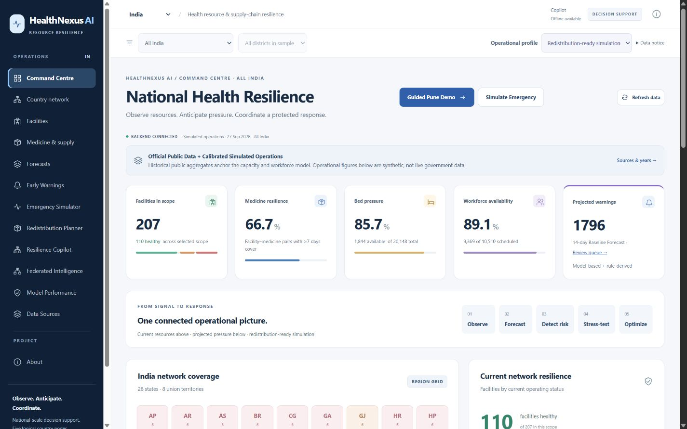

# HealthNexus AI

**Predict shortages. Coordinate safe resources. Share intelligence.**

HealthNexus is a national-scale healthcare resilience and resource decision-support prototype. Its Command Centre connects Official Public Data, Calibrated Simulated Operations, evaluated forecasts, an Emergency Digital Twin, Google OR-Tools redistribution and experimental five-country federated learning. Demand, supply, workforce and facility disruptions share the same operational pipeline.

India is the detailed showcase: **36 states/UTs, 69 illustrative districts, 207 fictional facilities**. Brazil, Russia, China and South Africa each have six representative facilities. These are five configured logical nodes, not connected government systems or exhaustive BRICS coverage.



[Phase 8.5 redesign and measured verification](docs/phase85-report.md) · [Desktop/mobile gallery](docs/screenshots/README.md)

## Problem

Resource imbalances can leave one facility short while another retains a safe buffer. Administrators need to see likely medicine, bed and workforce pressure, distinguish redistributable shortages from systemic insufficiency, and inspect the evidence behind a recommendation.

## Solution

A single Command Centre connects baseline forecasting, early warnings, controlled emergency scenarios and protected domestic redistribution. Every operational profile and projection stays identifiable. The separate federation experiment shares parameters and aggregate metadata across logical country nodes.

## Why it matters

Prediction alone does not move supplies. HealthNexus connects resource stress to a measurable response, while reporting remaining shortages honestly. It never invents safe donors to make a demonstration look successful.

## Key capabilities

- Command Centre, country/region/district filters, facilities, medicine inventory and provenance.
- Baseline Forecasts with empirical uncertainty and Estimated Stock-Out Risk.
- Early Warnings and four non-destructive emergency scenario types.
- Google OR-Tools CP-SAT plans with safe donor reserves, conservation and a greedy comparison.
- Two reproducible Operational Profiles: constrained and redistribution-ready.
- Resilience Copilot with 13 authoritative tools, native Gemini function calling and explicit offline summaries.
- A separate 417-parameter PyTorch Federated Model with actual FedAvg, country comparisons and measured progress.

## Demo

Start **Guided demo · Pune** on Command Centre. Follow Network → Forecast → Stress-test → Warnings → Redistribute → Federation → Offline summary. Severe 14-day Pune dengue is the flagship demand-surge preset; the Scenario Library also supports delivery delay, staff shortage and facility disruption. The guide configures geography/profile; it does not load an optimizer answer.

| Severe Pune dengue, 14 days | Redistribution-ready | Constrained |
|---|---:|---:|
| Receiver target deficit | 41,763 | 30,230 |
| Safe Donor Capacity | 17,745 | 0 |
| Accounting items transferred | 15,679 | 0 |
| Transfer lanes | 10 | 0 |
| Unresolved target | 26,084 | 30,230 |
| New donor risks / reserve violations | 0 / 0 | 0 / 0 |

Totals combine resource-specific medicine units for accounting; tablets, bags and sachets are not interchangeable. OR-Tools and greedy tie in this district case. Maximum individual receiver stock-out risk remains 100%; redistribution does not resolve every shortage. [Current measured acceptance](docs/evaluation/phase85-demo.json) · [90-second / 3-minute scripts](docs/final-demo-script.md).

## Architecture

Angular → FastAPI → trusted local operational engines. Public-source ingestion and provenance anchor simulation; forecasting drives warnings and scenario projections. OR-Tools independently solves plans. Gemini interprets typed tool evidence when available. Experimental country-local PyTorch models share parameters through FedAvg; they do not replace operational forecasting. [Architecture diagram](docs/architecture.md).

## Google Technologies

**Used:** Google OR-Tools, implemented and measured. The Gemini API layer uses the official `google-genai` SDK, Interactions, function results and structured evidence.

**Gemini status:** Integration implemented; full live workflow acceptance remains pending. Primary `gemini-3.8-flash`; fallbacks `3.7-flash → 3.6-flash → 3.5-flash → 3.5-flash-lite`. Gemini now cites server-issued request-local fact IDs; canonical source paths and exact numeric validation remain server-owned. The [current fact-citation report](docs/phase6-fact-citations-report.md) records 436 passing backend tests, shared mocks and the limited authorized Lite smoke results. Earlier provider/grounding evidence remains intact. Offline summaries are clearly labelled and require no key.

**Live grounded smoke acceptance: PASS 2/2. Full Phase 6 workflow acceptance remains pending.** Both independent Lite smokes passed the configured schema, citation and grounding checks. That checkpoint accepted only the two smokes and did not deploy.

The subsequent [bounded full workflow attempt](docs/phase6-full-live-report.md) ran native simulation and OR-Tools successfully with the canonical plan, then stopped on incomplete final synthesis. Exactly three new sends preserved 25 historical requests (28 total); no retry, fallback or later live case followed. Full Phase 6 acceptance remains pending.

**Deployment targets:** Firebase Hosting and Google Cloud Run. Neither is claimed deployed. Firestore is an optional existing snapshot adapter, not required for the local demo. [₹0 deployment decision](docs/deployment.md) · [Gemini architecture](docs/gemini.md).

## AI / ML

Operational models use 540-day simulated country-local histories, chronological training/selection/calibration/test periods and three mandatory baselines. India test WAPE: footfall **2.9969%**, pooled medicine demand **3.0799%**, admissions **3.3441%**. These measure simulator performance, not clinical accuracy. [Full comparisons](docs/phase3-results.md) · [Model card](docs/model-card.md).

## Emergency Digital Twin

Dengue surge, delivery delay, staff shortage and facility disruption propagate specified operational assumptions into demand, inventory, admissions, bed pressure and workload. Baseline data/models remain immutable. Scenario Projection is conditional decision support, not an outbreak prediction or clinical diagnosis.

## OR-Tools Optimization

Integer transfers remain domestic. Donors retain full-horizon reserves under all 500 sampled demand paths and current-cover protection. The solver chooses quantities and routes, then the engine recalculates risk and conservation. Straight-line distances, day-1 arrival and known receipts are prototype assumptions. [Optimization policy](docs/phase5-report.md) · [Both profiles](docs/phase55-report.md).

## Federated Learning

Five logical clients train a separate MLP and exchange model parameters plus aggregate metadata. The accepted five-round seed-42 run has **8.9472% global test WAPE**, **4.80 s training**, **614,235 logical boundary bytes**, and **0 raw operational training records shared**. India slightly degrades: **8.9496% → 8.9511% WAPE**. Four representative foreign nodes improve against their local-only MLPs. Federated learning does not guarantee every participant improves.

The integrity-checked accepted report loads after a restart; a new training button runs genuine FedAvg. Linux verification agrees within the documented CPU tolerance, with last-bit checkpoint differences recorded separately. [Accepted experiment](docs/phase7-report.md) · [Method/privacy](docs/federated-learning.md).

## Data Sources

Two attributed caches: MoHFW/PIB Health Dynamics of India 2022–23 summary (13 national observations) and WHO GHO bed/workforce indicators (20 observations across the configured countries). The Data Sources page exposes publishers, years, methodology and calibration. [Source catalogue](docs/data-sources.md).

## Real vs Simulated Data

Official Public Data are historical aggregate observations. Facility names/locations, demand, inventory, bed occupancy and attendance are simulated. Aggregate calibration does not make them official or live. No patient or employee identities are used. Districts/facilities are illustrative; foreign-country coverage is representative.

## Installation

Tested: Python 3.13, Node 22, npm, Docker Desktop Linux containers.

```powershell
python -m venv .venv
.\.venv\Scripts\python.exe -m pip install -r backend/requirements.txt
.\.venv\Scripts\python.exe -m pip install -r backend/requirements-federation.txt
cd frontend
npm ci
npm run build
cd ..
```

Use existing canonical generated/model assets on this checkout. Fresh machines can restore the trusted checksummed demo bundle; the explicit full bootstrap is documented in [deployment](docs/deployment.md). Startup never retrains or regenerates measured data. On macOS/Linux use `.venv/bin/python`.

## Environment Variables

Local operation needs no key. See [.env.example](.env.example): `HEALTHNEXUS_STORAGE=local`, explicit `HEALTHNEXUS_CORS_ORIGINS`, portable `PORT`, optional Compose host port overrides, backend-only Gemini configuration and opt-in Firestore credentials. Operational Profile is explicit in each request/UI selection. Angular's public `runtime-config.js` contains only the API origin; never credentials. Actual `.env` is ignored.

## Run Locally

```powershell
.\.venv\Scripts\python.exe scripts/prepare_demo.py
.\.venv\Scripts\python.exe -m uvicorn app.main:app --app-dir backend --host 127.0.0.1 --port 8000
# Second terminal:
cd frontend
npm start
```

Open [localhost:4200](http://127.0.0.1:4200). For the verified container product:

```powershell
docker compose build
docker compose up -d
# Frontend http://127.0.0.1:4200, backend http://127.0.0.1:8000
```

Compose bakes the trusted assets into the image, installs CPU PyTorch, uses a non-root backend, and deliberately disables Gemini. It does not pass the key. Existing ports can be preserved with `HEALTHNEXUS_FRONTEND_PORT` / `HEALTHNEXUS_BACKEND_PORT` overrides; final acceptance used 14200 / 18000.

## Reproduce Demo

```powershell
.\.venv\Scripts\python.exe scripts/verify_demo.py
.\.venv\Scripts\python.exe scripts/smoke_demo.py --base http://127.0.0.1:8000
.\.venv\Scripts\python.exe scripts/federate.py evaluate --report docs/evaluation/phase7-run.json
```

Verifier checks source caches, all country/profile/model partitions, planning-cache identities, canonical model reload, both newly computed OR-Tools outcomes, offline Copilot, malformed inputs, static frontend assets and secret patterns. It blocks provider transport. `prepare_demo.py` runs these checks without retraining. `package_demo.py` / `restore_demo.py` support laptop portability; restore refuses to overwrite differing measured assets.

## Model Evaluation

[Final technical report](docs/final-technical-report.md) is the current source of truth. Historical reports remain available. Final acceptance: **340 backend tests**, Python compilation, dependency sanity, strict TypeScript, Angular production build, actual Docker/API/startup, desktop/mobile review and canonical demo verifier. [Validation](docs/validation.md) · [Verified pitch facts](docs/hackathon-facts.md).

## Privacy & Safety

Raw training records remain local to each simulated country client. Model parameters and aggregate metadata are exchanged. **Secure aggregation and differential privacy are not implemented; updates can leak information.** This is logical isolation in one service, not a privacy guarantee. Production needs authenticated clients, transport/security controls and durable workflows.

HealthNexus assists administrative resource planning. It does not diagnose, prescribe, execute transfers or replace professional review. Donor “safe” means protected under the documented simulator policy, not a guarantee about actual care.

## Deployment

**Docker verified. Cloud deployment not performed.** Firebase static Hosting is prepared; Cloud Run requires billing, which was not enabled. No live Firestore migration was attempted. Recommended ₹0 submission uses the reproducible local demo and actual captures. [Prerequisites, commands and limitations](docs/deployment.md).

## Limitations

- Simulated operations and representative facility coverage; no live government stock feed.
- Forecast/scenario risks are model-based and not clinically validated.
- Mixed medicine totals are accounting sums; distances are straight-line and arrivals assume day 1.
- Unequal federation sample sizes and simulator similarities limit conclusions; India degradation remains visible.
- New scenario/plan/conversation/run IDs are process-local and expire at restart; canonical saved evidence persists.
- No production administrator authentication, distributed job queue, DP, secure aggregation or penetration test is claimed.
- Gemini real-provider acceptance is pending; the core demo works explicitly offline.

## Repository Structure

| Path | Role |
|---|---|
| `frontend/` | Angular Command Centre, guided journey and operational pages |
| `backend/app/data_ingestion/`, `simulation/` | Public provenance and calibrated operations |
| `backend/app/forecasting/`, `warnings/`, `scenarios/` | Authoritative forecasting and response engines |
| `backend/app/optimization/` | Google OR-Tools policy and impact verification |
| `backend/app/ai/` | Shared Gemini tools, evidence and failover |
| `backend/app/federation/` | Separate genuine PyTorch/FedAvg experiment |
| `data/demo/federation/` | Small accepted checkpoint/report with integrity metadata |
| `scripts/` | Explicit preparation, verification, portability and experiments |
| `docs/` | Measured reports, sources, deployment decision and demo scripts |

## Hackathon Team

Team and member details have not yet been provided; confirm them before the final submission. No names or affiliations are invented.
