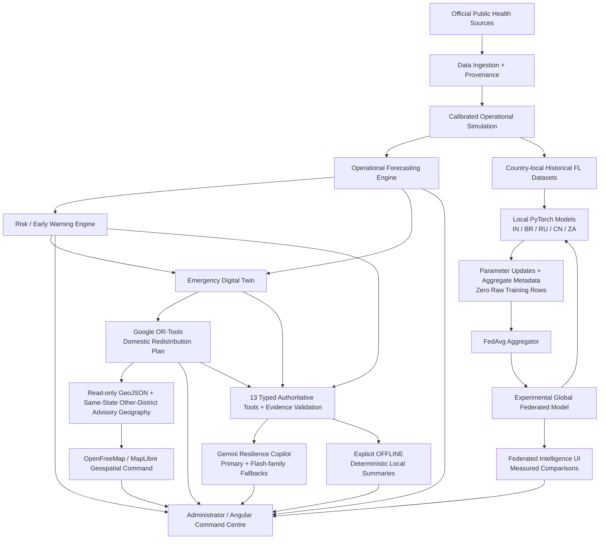

# HealthNexus architecture

Operational forecasting remains authoritative: saved country-local HGB/selected baselines, empirical uncertainty, 500 residual stock paths and immutable scenarios feed donor policy and OR-Tools. The separate federated MLP does not replace those models. The Phase 9 read-only map consumes actual projections, warning objects and saved advisory plan lanes; its public basemap never supplies operational facts. The FedAvg aggregator accepts typed serialized updates, not raw training tables.

Gemini selects registered tools and explains validated evidence. It never owns forecasts, risk severity, donor capacity or transfer quantities. Local summaries are a separate explicitly selected mode. **Phase 6 fully live-accepted on Gemini 3.5 Flash-Lite; the primary/fallback chain remains unchanged.**

Two inventory profiles share compatible demand model weights but keep separate snapshots, hashes, scenarios and caches. `constrained` preserves the insufficient network; `redistribution-ready` models uneven replenishment. Profile identity cannot silently mix across a plan.

## Runtime and deployment boundaries

Angular uses relative `/api` locally/nginx, or a public HTTPS origin in `runtime-config.js`. FastAPI runs one bounded process with `/health` and a no-provider `/readiness`. Forecast bundles validate trusted checksums and versions before deserialization; federation checkpoints are numeric NPZ without pickle. Public/simulated assets are baked into the verified Docker image. The backend is non-root; only experiment storage is writable among application assets.

Scenario/optimization/conversation/new-run indexes are bounded process-local state. The canonical measured federation report/checkpoint is read-only saved evidence and persists across restarts. Firestore's opt-in snapshot adapter is separate from transient workflow storage; no live database acceptance or durable queue is claimed.

Firebase Hosting and Cloud Run remain deployment targets. Cloud Run requires billing; no cloud resources were changed. The verified local Docker demo is the ₹0 route. [Decision and future commands](deployment.md).

## Trust and privacy

Official Public Data are historical aggregate statistics. Calibrated Simulated Operations are facility-level engineering data, not live government feeds. All geographic coverage and timestamps remain visible. Country-local training is logical separation inside a same-process prototype. Model updates may leak; no differential privacy, secure aggregation, authenticated clients or encrypted federation network is implemented.

For detailed schemas/identities see [API](api.md), [operational models](model-card.md), [scenario policy](phase4-report.md), [optimizer](phase5-report.md), [profiles/caches](phase55-report.md), [Gemini](gemini.md) and [federation](federated-learning.md).

Phase 9 map coordinates are read-only display geometry: project-owned rounded district anchors plus stable SHA-256 facility offsets. Original snapshot latitude/longitude and optimizer Haversine inputs remain immutable. Map lanes retain actual plan quantities and `distance_km`; the separate `map_distance_km` is labelled illustrative, never road routing or logistics feasibility.
