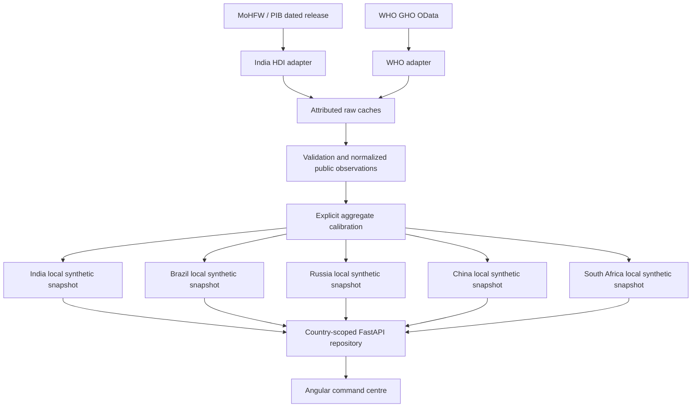

# Architecture

`data_ingestion/base.py` defines the adapter contract, raw envelopes, checksums and atomic JSON writes. `india_hdi.py` parses the actual dated PIB summary. `who_gho.py` requests official indicator records, handles bounded pagination on the same HTTPS API host, and rejects foreign-host continuations. `catalog.py` orchestrates imports and verifies raw/normalized correspondence. API routes consume this layer rather than embedding download logic.

Refresh is explicit (`scripts/import_official_data.py --refresh`). Normal reads do not require external network access. Caches have source URLs, actual access dates, terms, payload hashes and adapter versions. Invalid data fails validation; missing data produces visible calibration fallbacks. Per-file replacement is atomic. A refresh can succeed for one source and fail for another; each source's vintage remains visible. If normalization is stale relative to a valid raw cache, the read path reconstructs it offline; edits to normalized records with the same source identity are rejected.

`data/official` stores small factual extracts, `data/normalized` stores typed observations, and `data/generated` stores fictional operations. Public input observations are frozen into each generated snapshot. Derived geography/calibration, synthetic operations and future simulation have separate provenance categories. A source hash indicates integrity, not external endorsement or completeness.

India retains its legacy snapshot path and API default. Other country snapshots use separate node paths. New snapshots are schema 2; schema-1 India records migrate to explicit uncalibrated provenance. Foreign facilities do not require districts. Graph validation rejects country/region mismatches, invalid coordinates, inconsistent histories and missing provenance references.

Local storage is the tested default. Optional Firestore uses `country_nodes/<code>/metadata/network`, plus region, district, facility and alert subcollections. Legacy India reads remain available. Server-side credentials stay outside frontend code. These are logical partitions in one service, not independently deployed or authenticated national systems.

## Planned learning and resource flows

Phase 3 adds an explicit offline path: country history → frozen-origin temporal tables → country-local candidate fitting → chronological selection → separate residual calibration → held-out evaluation → saved artifact. Three pooled targets per country share facilities only within that country. `forecasting/` separates features, evaluation, training, prediction, stockout calculations, typed schemas and routes. The read-only API lazily loads trusted saved bundles; it never fits a model at startup. Models and snapshots have matching hashes and dates; mismatches produce a visible unavailable response. See the model card for overlap between rolling evaluation origins and source-vintage limitations.

The future federation flow remains local dataset → local training → model update → federated aggregation → global model → local node. Phase 3 performs actual local forecasting training and evaluation; no federated rounds or pooled global operational training dataset exist. The BRICS page links measured local metrics and keeps federation marked not started.

Domestic redistribution will operate within a selected country's boundary and preserve donor reserves. It is separate from federation. Future cloud targets are Firebase Hosting, Cloud Run and Firestore; the Docker setup is a local deployment scaffold. No Gemini, OR-Tools, FedAvg or production cloud deployment is claimed for Phase 2.
