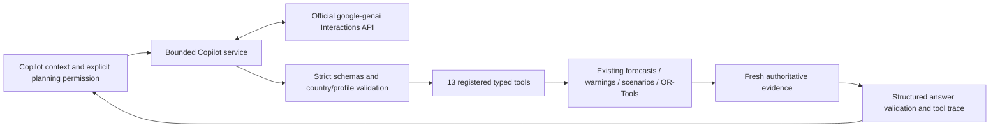
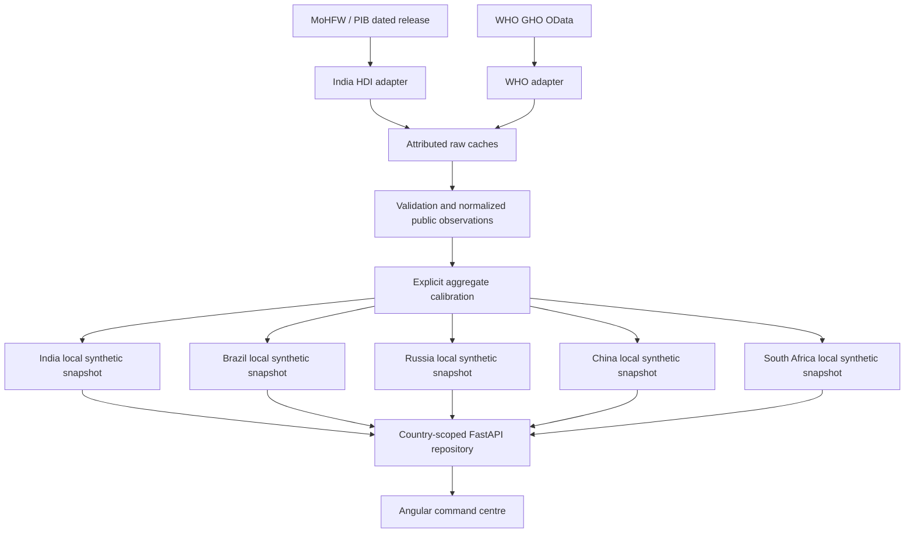

# Architecture

## Phase 6 resilience Copilot

`app/ai` adds orchestration without changing forecasting, warning, scenario, optimization or inventory policies. The existing ScenarioEngine and OptimizationService instances are shared. Exact `gemini-3.8-flash`, medium thinking and the official SDK 2.25.0 are configured; no provider call occurs at startup. Explicit offline mode uses deterministic templates and the same local tools. No live Gemini response has been verified because server credentials are absent.

Pydantic rejects unknown arguments before execution. Registered tools enforce selected geography, profile, scenario snapshot/model identity and explicit non-destructive planning permission. Native function calls return matching call IDs; Interactions continuation carries provider state. Final claims refer to fresh result fields, with numeric checks and a separate authoritative result view. These checks cannot establish the complete semantic truth of arbitrary model prose.

Conversations, request progress and sanitized audit records are bounded in process memory. Provider history is stored for Interactions continuation; deleting a local conversation does not delete provider history. These context partitions do not provide production authentication. See [integration, retention and limitations](gemini.md), [API](api.md) and [measured report](phase6-report.md). FedAvg remains future work.

`data_ingestion/base.py` defines the adapter contract, raw envelopes, checksums and atomic JSON writes. `india_hdi.py` parses the actual dated PIB summary. `who_gho.py` requests official indicator records, handles bounded pagination on the same HTTPS API host, and rejects foreign-host continuations. `catalog.py` orchestrates imports and verifies raw/normalized correspondence. API routes consume this layer rather than embedding download logic.

Refresh is explicit (`scripts/import_official_data.py --refresh`). Normal reads do not require external network access. Caches have source URLs, actual access dates, terms, payload hashes and adapter versions. Invalid data fails validation; missing data produces visible calibration fallbacks. Per-file replacement is atomic. A refresh can succeed for one source and fail for another; each source's vintage remains visible. If normalization is stale relative to a valid raw cache, the read path reconstructs it offline; edits to normalized records with the same source identity are rejected.

`data/official` stores small factual extracts, `data/normalized` stores typed observations, and `data/generated` stores fictional operations. Public input observations are frozen into each generated snapshot. Derived geography/calibration, synthetic operations and future simulation have separate provenance categories. A source hash indicates integrity, not external endorsement or completeness.

India retains its legacy snapshot path and API default. Other country snapshots use separate node paths. New snapshots are schema 2; schema-1 India records migrate to explicit uncalibrated provenance. Foreign facilities do not require districts. Graph validation rejects country/region mismatches, invalid coordinates, inconsistent histories and missing provenance references.

Local storage is the tested default. Optional Firestore uses `country_nodes/<code>/metadata/network`, plus region, district, facility and alert subcollections. Legacy India reads remain available. Server-side credentials stay outside frontend code. These are logical partitions in one service, not independently deployed or authenticated national systems.

## Planned learning and resource flows

Phase 3 adds an explicit offline path: country history → frozen-origin temporal tables → country-local candidate fitting → chronological selection → separate residual calibration → held-out evaluation → saved artifact. Three pooled targets per country share facilities only within that country. `forecasting/` separates features, evaluation, training, prediction, stockout calculations, typed schemas and routes. The read-only API lazily loads trusted saved bundles; it never fits a model at startup. Models and snapshots have matching hashes and dates; mismatches produce a visible unavailable response. See the model card for overlap between rolling evaluation origins and source-vintage limitations.

The future federation flow remains local dataset → local training → model update → federated aggregation → global model → local node. Phase 3 performs actual local forecasting training and evaluation; no federated rounds or pooled global operational training dataset exist. The BRICS page links measured local metrics and keeps federation marked not started.

Domestic redistribution will operate within a selected country's boundary and preserve donor reserves. It is separate from federation. Future cloud targets are Firebase Hosting, Cloud Run and Firestore; the Docker setup is a local deployment scaffold. No Gemini, OR-Tools, FedAvg or production cloud deployment is claimed for Phase 2.

## Phase 4 operational resilience

Saved country-local forecasts → selected facility copies → explicit scenario adjustment → conserved inventory/bed/workforce propagation → common warning rules → backend comparison → Angular views. `scenarios/` owns snapshot isolation and bounded process-local runs; `warnings/` owns deterministic facts, deduplication, priority and aggregation. Both reuse the existing forecast service and residual bootstrap. `core/risk_config.py` versions assumptions. Baseline snapshots, histories and fitted artifacts remain unchanged. Cached forecasts and baseline projections are keyed by country, origin, facility hash and model version. Scope validation prevents cross-country scenario reads.

This is an operational resilience digital twin. Dengue is an externally specified fever-demand shock. Phase 4 did not include optimization; Phase 5 adds it below. No epidemiological prediction, Gemini or federated training is present. Scenario storage currently requires one server worker and is not durable. See [Phase 4 report](phase4-report.md).

## Phase 5 domestic redistribution

The shared ScenarioEngine supplies immutable baseline/scenario projections to `optimization/`. Candidate construction protects every donor across 14 days of point demand and all 500 paired paths, with known receipts and full safety reserves. Country/resource/scope filters build eligible edges; actual OR-Tools CP-SAT solves three lexicographic objectives (critical unmet targets, weighted unmet targets, transport cost). A separate nearest-safe-donor greedy routine uses identical feasibility constraints.

Plans apply integer net transfers to copies at forecast origin, conserve each resource, reuse paired residual paths and recompute stock/warning outcomes. The service verifies scenario snapshot and model identity and rejects donor safety/risk regressions. Bounded run storage supports country-aware GET/DELETE without altering scenarios or models. Angular exposes candidate previews, solver evidence, transfer reasoning, before/after balances and comparison. No dispatch provider or international transfer exists. See [Phase 5 report](phase5-report.md), including the current Pune snapshot's lack of safe surplus and the open positive-demo prerequisite.
