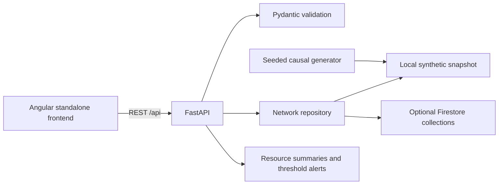

# Architecture

The frontend uses the relative `/api` prefix. Angular's development proxy and the container Nginx reverse proxy keep requests on the same origin. `NetworkApi` centralizes typed requests; route/query changes cancel stale reads. State and district selections are URL parameters, so drill-down links can be reopened.

`NetworkRepository` supports local and Firestore sources. Local generation is reproducible by seed and snapshot date. Each facility's latest inventory reconciles opening + received − consumed. Medicine consumption depends on patient demand. Patient demand combines capacity, a synthetic catchment multiplier, day of week, seasonal effect, trend and bounded noise. Daily history is observational synthetic data, not a forecast.

Risk rules: stock cover under 3 days is CRITICAL; 3–<7 AT_RISK; 7–<10 WATCH; ≥10 HEALTHY. Staff presence below 80% adds an AT_RISK signal. Facility status takes the worst resource/staff status. Readiness scores are categorical prototype values (96/78/55/28), not clinically validated measures. Bed utilisation is descriptive in Phase 1.

The store serves a snapshot, not transactional inventory mutations. The API is read-only and intended for local demonstration. Authentication, RBAC, audit logs, structured cloud error reporting and credential controls are deployment prerequisites.

## Planned services

- Forecasting: evaluated time-series model, temporal train/test split, baseline comparison and uncertainty.
- Simulation: scenarios change footfall, disease mix, consumption, capacity and forecasts.
- Optimization: OR-Tools with shortage constraints, donor reserves, distance, time and capacity within India.
- Gemini: server-side structured tools over computed facts; no numerical prediction by the LLM.
- Federation: state/regional local training → update validation → FedAvg national aggregation → redistribute shared model. Shared feature/parameter schemas are necessary. Gradient-boosted trees cannot simply be averaged with FedAvg; use a compatible lightweight linear/neural model for federation.

No placeholder endpoint returns invented AI output. These services will be added with their actual implementations.

## Hosting target

Frontend: Firebase Hosting. Backend: Google Cloud Run. Database: Firestore. The included Firebase template routes `/api/**` to a future `healthnexus-api` Cloud Run service in `asia-south1`. An authenticated, reviewed backend and a chosen project are required before publishing. Cloud deployment, authentication and costs are not exercised by local startup.
