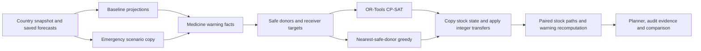

# Phase 5 — domestic resource redistribution

Implemented in the existing repository on 28 September 2026. Phases 1–4, geography, saved models and generated operational snapshots are preserved. The new engine uses **Google OR-Tools 9.15.6755 CP-SAT**, not a heuristic disguised as an optimizer.

**The current Pune demo has no safe donor capacity.** The application correctly returns an optimal *constrained* zero-transfer plan with unresolved shortages. The requested positive-transfer Pune demonstration is therefore not fulfilled by the existing snapshot. We did not invent donor inventory, reduce reserves to obtain a nicer result, retrain models, or fabricate an OR-Tools advantage. Nonzero transfers and their complete impact calculation are verified with explicitly constructed test fixtures. A positive live demo needs a separately specified, internally consistent replenished operational snapshot and matching forecast artifacts. This is a data prerequisite, not evidence that the present shortage can be solved by redistribution.

## Architecture



`optimization/config.py` versions assumptions; `schemas.py` defines API inputs/results; `candidates.py` computes protection and feasible country-local edges; `distance.py` implements Haversine; `solver.py` contains CP-SAT and the independent comparator; `impact.py` conserves stock and recomputes projections; `service.py` validates scenario identities, orchestrates and stores runs; `routes.py` exposes the API. The optimizer and emergency routes share **one ScenarioEngine instance**.

India retains all 36 states/UTs, 69 illustrative districts and 207 fictional facilities. Brazil, Russia, China and South Africa retain their representative nodes. Physical transfers never cross country boundaries. Receiver geography uses the existing country/state/district filters. District and state searches restrict both endpoints; national search extends donor eligibility within the country. Scenario projections replace baseline projections only for facilities actually affected by that scenario. Unaffected donors retain baseline demand and paired residual seeds.

## Donor and receiver calculations

For each facility/resource, let `I` be integer stock at the forecast origin, `D[t]` point demand, `D[s,t]` its 500 paired demand paths, and `R[t]` known receipts on the baseline/scenario arrival dates. Historical commitments are already reflected in opening stock; there is no additional forward commitment feed in the existing simulator. Independent proposed plans are alternatives, never executed or stacked as commitments.

Calculate **unclipped** cumulative balances, including the origin:

```
B[t]   = I + sum(R[k] - D[k], k <= t)
B[s,t] = I + sum(R[k] - D[s,k], k <= t)
minimum = min(I, all B[t], all B[s,t])
reserve = ceil(safety_stock × 1.0) + 1
current_floor = max(reserve, ceil(7 × mean(D)))
safe_surplus = max(0, floor(min(minimum - reserve, I - current_floor)))
receiver_target = max(0, ceil(max(reserve - min(B[t]), current_floor - I)))
```

This protects reserve on **every day in every sampled path**, protects current cover, and prevents future receipts from funding a dispatch that cannot be made now. Using raw balances avoids treating stock clipped to zero after unmet demand as available surplus. Protection spans the complete 14 days. Request horizons other than 14 are explicitly rejected; the existing emergency and warning system also uses 14-day projections.

A receiver target includes point-demand coverage, reserve and current-cover needs. It is not the same as expected unmet demand; both are displayed separately. Transfers do not target beds or staff. Warning severity, priority, safety breach, depletion and 3/7/14-day probabilities come from the existing medicine projections and warning rules. A *critical target* means expected unmet medicine demand or a CRITICAL medicine warning; it is distinct from the count of CRITICAL warning records.

## Integer model and constraints

For every eligible donor/receiver/resource edge, CP-SAT creates integer `x[e] >= 0` and Boolean `used[e]`. Each receiver has integer unresolved target `u[r] >= 0`.

- `sum(outgoing[d,m]) <= safe_surplus[d,m]`.
- `sum(incoming[r,m]) + u[r,m] == target[r,m]`.
- `x[e] <= min(donor_surplus, receiver_target) × used[e]` and `x[e] >= used[e]`.
- Edges require identical country and resource, distinct facilities, and the selected district/state/national scope.
- Candidate bounds enforce nonnegative opening inventory, full projected reserve protection and integer units.
- Scenario country, origin, selected baseline-facility hashes and saved model version must match the current context. Mismatches fail explicitly.

Public planning permits unresolved targets, so an insufficient network remains feasible. An internal `require_full` diagnostic is tested to return genuine `INFEASIBLE` when full service is impossible; it is not exposed as the normal planning policy.

## Objective and policy weights

Three **lexicographic** minimizations share one total solve budget:

1. Unresolved units for critical targets, coefficient 1.
2. All unresolved targets weighted by severity, urgency, risk and warning priority.
3. Transport/geographic/risk costs and the number of used transfer lanes.

A later stage is attempted only after the preceding optimum has been proved and fixed as a hard equality. Transport cost therefore cannot displace an avoidable critical unit in a proved lexicographic solution.

`redistribution-v1` configuration:

| Factor | Value |
| --- | ---: |
| Reserve multiplier / extra integer buffer | 1.0 / 1 unit |
| Current point-demand cover floor | 7 days |
| Base shortage weight | 100 |
| Severity rank weight (INFO 0, WATCH 1, WARNING 2, CRITICAL 3) | 100 |
| Urgency per day before horizon end | 10 |
| 14-day stock-out probability weight | 100 |
| Existing warning priority weight | 1 |
| Critical unresolved unit coefficient, first stage | 1 |
| Distance cost per rounded kilometre per unit | 1 |
| Donor 14-day risk weight per unit | 100 |
| Same-district geographic penalty | 0 |
| Different district, same state penalty per unit | 1,000 |
| Different state, same country penalty per unit | 10,000 |
| Cost per nonzero transfer lane | 100 |
| Default total solver budget | 10 seconds |
| API allowed solver budget | 0.01–30 seconds |
| CP-SAT workers / random seed | 1 / 42 |

Second-stage weight is `100 + 100×rank + 10×(14-days_to_depletion) + round(100×risk14) + round(priority)`. No depletion date gives urgency zero. Distance uses Earth radius 6371.0088 km; exact Haversine kilometres are retained in results, while the integer objective rounds kilometres. Donor risk is normally zero under the strict sampled-path protection policy. Geographic preference is a documented cost, not a claim of actual route availability. The objective aggregates heterogeneous medicine units as a prototype policy; they are not clinically interchangeable.

The solver uses one worker and a fixed seed for reproducible proved solutions. Time-limited incumbents may vary with available wall time. Every stage returns actual status, objective, bound and solve time. The overall result is `OPTIMAL` only after all three stages prove optimality. A retained incumbent after budget exhaustion is `FEASIBLE`; no incumbent is `UNKNOWN` with a time-limit termination reason. `INFEASIBLE` and `MODEL_INVALID` are preserved when returned. No greedy fallback is mislabeled as a solver result.

## Non-destructive impact calculation

Transfers are assumed to arrive **at the origin, before forecast day 1**. There are no transit times, loss rates, vehicle capacities or dispatch-provider calls. After separately accumulating all incoming/outgoing quantities, the system checks capacities and applies net changes to copied resource projections:

```
donor_origin_after = donor_origin_before - total_outgoing
receiver_origin_after = receiver_origin_before + total_incoming
sum(origin_stock_before[m]) == sum(origin_stock_after[m])
```

Changed resources rerun `project_stock` with the same point demand, 500 paired paths and receipt dates. This recomputes daily closing inventory, expected unmet demand, conditional intervals, safety/depletion dates, cover and stock-out probabilities. Warning rules are reevaluated and linked to the planning run. A post-check rejects any plan that breaches protected donor capacity or increases donor sampled stock-out risk, unmet demand or safety-breach exposure. The donor reserve and receiver after-values on a transfer include **all transfers in that plan**, not just that row.

Only affected receiver and used-donor facility details are included in result trajectories; per-resource conservation covers the entire search scope. The result retains both warning lists and the full candidate evidence. Plans live in a separate locked, bounded in-memory store (30 alternatives). GET returns copies. DELETE removes only that plan. Baseline data, histories, scenarios and models are untouched. Use one backend worker; restart clears stored plans and scenarios.

## Measured Pune severe-dengue demo

Source: [live API measurements](evaluation/phase5-smoke.json), origin 2026-09-27, severe dengue starting the next day for 14 days, seed 42. Receiver scope India / Maharashtra / Pune. All five canonical medicines selected.

| Resource | Target deficit before | Expected unmet demand | Safe national donor units | Transferred | Target deficit after |
| --- | ---: | ---: | ---: | ---: | ---: |
| PCM, tablets | 25,870 | 16,124.2701 | 0 | 0 | 25,870 |
| IVF, bags | 2,304 | 950.8857 | 0 | 0 | 2,304 |
| ORS, sachets | 1,054 | 0 | 0 | 0 | 1,054 |
| AMX, capsules | 434 | 0 | 0 | 0 | 434 |
| IFA, tablets | 568 | 0 | 0 | 0 | 568 |
| Accounting total | **30,230** | **17,075.1558** | **0** | **0** | **30,230** |

There are 15 receiver/resource pairs, including 6 critical targets from expected unmet PCM/IVF demand. The existing warning engine labels these projected medicine shortages WARNING rather than CRITICAL because the point depletions occur later than its three-day critical window. We preserve those rules: **critical medicine warning records are 0 → 0**. The scenario's separate bed/personnel/emergency critical warnings are not counted as medicine-transfer successes.

District, state and national plans all prove `OPTIMAL`, objective vector **[28,174, 19,987,301, 0]**. There are no selected donor IDs or lane distances to report: transfer count, transferred units, lane kilometres and distance-weighted units are all zero. Unresolved targets remain 30,230; expected unmet demand remains 17,075.1558; facilities at risk remain 3; maximum individual 14-day medicine risk remains 100%. New donor risks and reserve violations are zero, with zero donors used. No actual donor before/after risk comparison is applicable.

The UI explicitly states: **Network resources are insufficient to completely resolve this shortage.** Examination of the point forecasts alone found no India facility/resource preserving its original safety stock on every forecast day. The empty donor pool is therefore not merely an artifact of choosing the worst of 500 paths.

Final live measurements: district API planning 0.24 s; state 0.31 s; warm national 8.71 s. The national Pune CP-SAT solve itself took 0.0060 s. Cold all-India baseline planning took 109.50 s, mostly saved-forecast/projection preparation and serialization; its solver took 0.128 s. An earlier run measured 44.23 s cold and 6.77 s warm national, so preparation latency varies materially on this machine. The solver budget does not bound forecast preparation. Frontend loading state remains visible during preparation. See the JSON for the final timings; cold preparation remains a performance limitation.

## Actual OR-Tools vs greedy comparison

The comparator visits critical receivers first, then decreasing shortage weight, and assigns from the geographically nearest eligible safe donor until either capacity or target is exhausted. It uses exactly the same candidate edges, integer capacities, impact engine and donor protection as CP-SAT.

| Pune national measure | OR-Tools | Greedy |
| --- | ---: | ---: |
| Unresolved target | 30,230 | 30,230 |
| Expected unmet demand | 17,075.1558 | 17,075.1558 |
| Transfers | 0 | 0 |
| Total lane distance, km | 0 | 0 |
| Distance × units | 0 | 0 |
| Donor safety violations / new donor risks | 0 / 0 | 0 / 0 |
| Critical medicine warnings resolved | 0 | 0 |

**They tie.** No improvement or superiority is claimed. Separate solver tests include multiple donors/receivers, scarce supply, distance tradeoffs and critical-priority dominance. A clearly artificial two-facility impact fixture transfers 181 tablets, reduces expected unmet demand 130 → 0 and sampled risk 100% → 0, retains donor stock 819 and preserves total origin stock 1,010. That is a correctness test, not a measured Pune outcome.

## API and UI

- `POST /api/optimization/preview`: validated receiver and donor pools before solving.
- `POST /api/optimization/redistribution`: solve, compare, simulate and store; HTTP 201.
- `GET /api/optimization/runs/{run_id}?country_id=IN`: retrieve the same planning result.
- `DELETE /api/optimization/runs/{run_id}?country_id=IN`: discard; HTTP 204.
- `GET /api/optimization/config`: versioned policy.

Example input:

```json
{
  "country_id": "IN",
  "state_id": "MH",
  "district_id": "MH-PUNE",
  "scenario_id": "use-an-existing-scenario-id",
  "scope": "national",
  "resources": ["PCM", "IVF", "ORS", "AMX", "IFA"],
  "horizon": 14,
  "time_limit_seconds": 10
}
```

Omit `scenario_id` for baseline planning. District requires `district_id`; state requires `state_id`. Invalid or duplicated resources, foreign scenarios, stale identities and unsupported horizons fail visibly. Geography and unknown country-scoped run IDs return 404; invalid requests return 422; unavailable saved forecast artifacts return 503.

The **Redistribution Planner** navigation item and active emergency **Optimize Redistribution** link retain country/geography/scenario context. The page includes candidate pools, actual solver status/evidence, target and unmet-demand metrics, donor → receiver cards, calculated reasons, resource-specific risk/warning comparisons, daily stock balances, unresolved targets, conservation, greedy outcomes and discard. Long candidate tables are progressively revealed. No execution action or Gemini explanation is present.

## Validation and limits

Backend regression and solver checks, Python compilation, strict TypeScript, Angular production build, live API country isolation and desktop/mobile browser checks are recorded in [validation.md](validation.md). The live smoke covers baseline planning in all five countries, Pune district/state/national insufficient-network planning, exact GET round trips, immutable scenario/facility data and country-aware discard. All current country snapshots have zero safe donors under this policy; baseline target deficits are IN 217,947, BR 6,359, RU 3,956, CN 6,022, ZA 5,902.

Facilities/inventories are simulated. Emergency effects are unvalidated. Haversine distance is not road distance. Arrival, transport capacity and execution are simplified; no logistics provider is integrated. Policy weights are assumptions. This is administrator decision support, not a government order or clinical instruction. Resource isolation is enforced in planning, but production authentication and durable multi-worker storage remain separate work.

The architecture exposes typed, auditable tools suitable for the requested **Phase 6 — Gemini 3.8 Flash Resilience Copilot & Tool Calling**. That is the user's proposed phase/model label, not a claim that this model exists or is integrated. Actual model availability must be verified when Phase 6 is authorized. Gemini and federated training are not implemented. The positive-transfer Pune data prerequisite above remains open and should be resolved before presenting that specific success demo as complete.

Implementation references: [Google CP-SAT integer modeling and status definitions](https://developers.google.com/optimization/cp/cp_solver), [Google solver limits](https://developers.google.com/optimization/cp/cp_tasks), [OR-Tools 9.15.6755 distribution](https://pypi.org/project/ortools/9.15.6755/).
