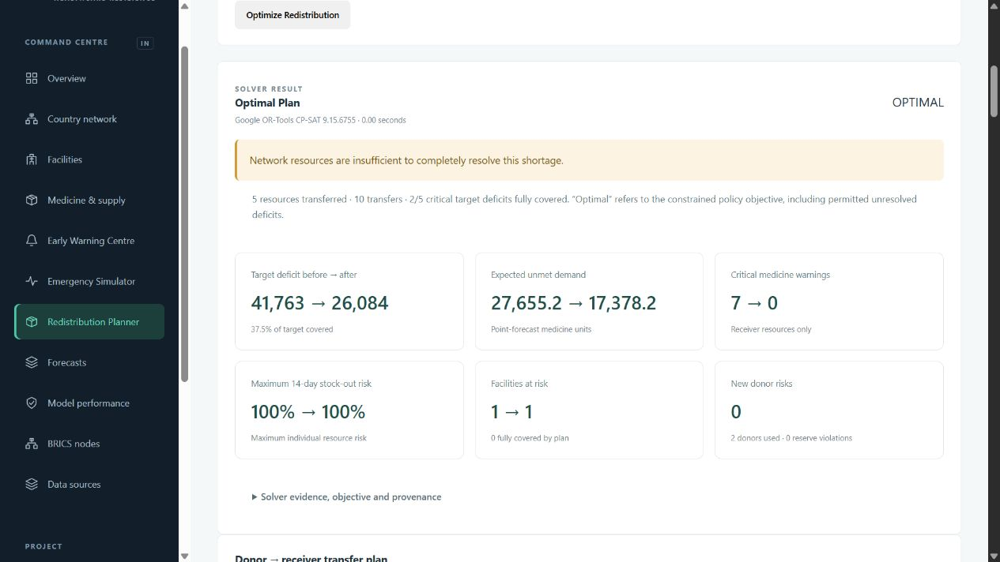

# Phase 5.5 — reproducible operational profiles and preparation

Implemented in the existing HealthNexus AI repository on 28 September 2026. Phases 1–5, the original constrained files, saved model weights, OR-Tools objective and donor protection policy remain intact. Gemini is not integrated.

## Measured demonstrations

Both demonstrations use India → Maharashtra → Pune, Severe Dengue, 14 days, scenario seed 42, forecast origin 2026-09-27, and a district donor search. OR-Tools 9.15.6755 independently solves all three lexicographic stages to OPTIMAL. No transfer answer is loaded by either demo button.

| Metric | Constrained | Redistribution-ready |
|---|---:|---:|
| Receiver target before | 30,230 | 41,763 |
| Safe donor capacity | 0 | 17,745 |
| Transferred units / lanes | 0 / 0 | 15,679 / 10 |
| Unresolved target after | 30,230 | 26,084 |
| Expected unmet before → after | 17,075.1558 → 17,075.1558 | 27,655.2181 → 17,378.1980 |
| Receiver critical medicine warnings | 0 → 0 | 7 → 0 |
| Maximum individual 14-day stock-out risk | 100% → 100% | 100% → 100% |
| Receiver facilities at risk | 3 → 3 | 1 → 1 |
| Donor protection violations / new risks | 0 / 0 | 0 / 0 |

Unit totals above are inventory-item tallies across tablets, capsules, bags and sachets. They are not interchangeable clinical doses. Resource-specific quantities below preserve their own units. A target includes reserve and current-cover protection; it is different from expected unmet demand.

The constrained case remains a legitimate insufficient-network result: 30,230 target units unresolved, zero safe donors, zero transfers, and an OR-Tools/greedy tie. It is never replaced by the positive profile.

The positive district case uses two safe donors (IN-MH-PUNE-001, Pune · PHC 01; IN-MH-PUNE-002, Pune · CHC 02) and one receiver (IN-MH-PUNE-003, Pune · District Hospital 03). This small three-facility district does not contain multiple receiver facilities; it has five receiver/resource pairs and multiple feasible donor combinations. Wider scopes expose additional donors, but the primary reproducible demonstration stays within Pune.

## Resource outcomes

| Resource / unit | Target before | Safe capacity | Transferred | Target after | Expected unmet before → after | Receiver 14-day risk |
|---|---:|---:|---:|---:|---|---|
| PCM / tablets | 28,086 | 5,139 | 5,139 | 22,947 | 21,287.09 → 16,148.09 | 100% → 100% |
| IVF / bags | 3,256 | 1,083 | 1,083 | 2,173 | 2,313.10 → 1,230.10 | 100% → 100% |
| ORS / sachets | 3,655 | 2,691 | 2,691 | 964 | 1,979.52 → 0.00 | 100% → 0% |
| AMX / capsules | 3,276 | 4,080 | 3,276 | 0 | 1,230.98 → 0.00 | 100% → 0% |
| IFA / tablets | 3,490 | 4,752 | 3,490 | 0 | 844.52 → 0.00 | 100% → 0% |

AMX and IFA target deficits are fully covered. ORS has no expected unmet demand or sampled stock-out after transfer, but its reserve target still lacks 964 units. IVF and PCM retain meaningful unmet demand and 100% 14-day risk; their warning severity improves from CRITICAL to WARNING. Those remaining risks are explicitly shown.

Warnings across the three facilities decrease from 36 to 25 (critical 16 → 9, warning 17 → 13, watch 3 → 3). Receiver critical medicine warnings decrease from seven to zero. Bed and personnel constraints remain; no medical benefit or complete network recovery is claimed.

## Actual solver-selected lanes and reserves

Every receiver below is Pune · District Hospital 03. Distances are Haversine straight-line distances, not road travel distances. Worst protected minimum includes all 500 sampled paths, the point path, origin and all 14 forecast days. Values include every transfer in the plan.

| Donor | Resource | Quantity | km | Origin stock after | Worst protected stock after | Required reserve |
|---|---|---:|---:|---:|---:|---:|
| IN-MH-PUNE-001 | AMX | 798 | 6.4406 | 1,501 | 1,137.2348 | 333 |
| IN-MH-PUNE-001 | IFA | 610 | 6.4406 | 2,093 | 1,690.9199 | 428 |
| IN-MH-PUNE-001 | IVF | 463 | 6.4406 | 550 | 152.5453 | 152 |
| IN-MH-PUNE-001 | ORS | 1,135 | 6.4406 | 583 | 271.6869 | 271 |
| IN-MH-PUNE-001 | PCM | 1,600 | 6.4406 | 5,084 | 1,100.8154 | 1,100 |
| IN-MH-PUNE-002 | AMX | 2,478 | 4.4778 | 1,185 | 558.5508 | 558 |
| IN-MH-PUNE-002 | IFA | 2,880 | 4.4778 | 1,525 | 722.5200 | 722 |
| IN-MH-PUNE-002 | IVF | 620 | 4.4778 | 958 | 257.0938 | 257 |
| IN-MH-PUNE-002 | ORS | 1,556 | 4.4778 | 1,104 | 454.8735 | 454 |
| IN-MH-PUNE-002 | PCM | 3,539 | 4.4778 | 8,699 | 1,846.5091 | 1,846 |

All donor 3/7/14-day probabilities remain zero. No new donor safety breach, stock-out risk or unmet demand is introduced. Per-resource origin inventory is conserved exactly; receipts and demand paths stay unchanged.

## OR-Tools versus greedy

| Metric | OR-Tools | Greedy |
|---|---:|---:|
| Unresolved target | 26,084 | 26,084 |
| Expected unmet | 17,378.1980 | 17,378.1980 |
| Transfers | 10 | 10 |
| Lane distance sum (km) | 54.591839 | 54.591839 |
| Distance × units | 79247.990673 | 79247.990673 |
| New donor risks / reserve violations | 0 / 0 | 0 / 0 |
| Receiver critical medicine warnings removed | 7 | 7 |

The measured primary district plan ties greedy on these metrics. Inventory was not tuned to manufacture an OR-Tools advantage. The two donors have different distances and several feasible quantity combinations; CP-SAT proves the unchanged global policy objective. The objective remains critical unresolved units, then weighted unresolved units, then transport cost and lane penalties.

## Profile generation and model compatibility

Profiles are independent operational simulations. Metadata identifies `constrained` or `redistribution-ready`, `inventory-profile-v1`, seed 42, origin, purpose and inventory roles. No record is represented as actual government inventory. Profile identity is carried by snapshot metadata, baseline fingerprints, request/scenario definitions, forecast and warning provenance, optimization requests/transfers, API headers, reports and caches.

The constrained profile copies the preserved full history and compact facility records. Its facility hashes match the legacy snapshot exactly. The original files are not overwritten. The redistribution-ready profile replays all 540 historical days against the same requested medicine demand and facility context, then retains the latest 28 days in its API snapshot. Receipts, consumption, unmet requests, stock balances, activity medicine totals and known outstanding orders are recomputed together.

Generator assumptions are centralized in `backend/app/profiles/config.py`:

| Role | Target days of demand cover | Intent |
|---|---|---|
| Buffer | 49–56 | Local demand plus severe-demand/uncertainty/reserve headroom |
| Balanced | 24–28 | Adequate local replenishment, comparatively limited transferable headroom |
| Strained | 9–13 | Short cycle stock that can breach reserve or deplete under stress |

Facilities follow the documented repeating role pattern buffer, buffer, strained, balanced, strained, balanced in the preserved generator order. This gives India 70 buffer, 68 balanced and 69 strained facilities; other nodes have two of each. The pattern applies throughout each country, without donor/receiver edges or transfer quantities. Deterministic per-facility/resource seeds choose cover within each range.

Every seven days, the generator reviews prior-seven-day requested demand. It orders enough to reach target cover after deducting current inventory, arrivals that day and outstanding orders. Orders have a three-day lead time. Actual consumption is limited to available stock, with unmet demand retained. Initial opening stock follows the same coverage policy. Original safety thresholds remain unchanged. Future projections use only already known orders; they never assume unplaced future replenishment.

Buffer targets exceed the illustrative 28–35-day range because the existing severe-dengue PCM shock raises requested demand about 124%, and the unchanged policy protects every sampled day plus a reserve and current cover. A 49–56-day order target also has to survive the weekly review/lead cycle. This is an explicit engineering stress-test assumption, not a clinical stocking standard. The whole country is not overstocked.

Model weights are reused because full requested-demand histories and all training contexts are byte-equivalent. Consumption is not the forecast target. The generator checks this demand signature, original facility hashes and the original training-history hash before binding the new snapshot. Runtime compatibility checks validate the profile snapshot/history/source hashes, model SHA-256, model version, country, origin and profile version. Changed demand requires the explicit Phase 3 training workflow; inventory-only profile generation never trains.

Compatibility manifests retain the model training-history hash separately from the profile operational-history hash. The model training report remains an evaluation of the preserved demand simulator, not a new evaluation against real healthcare data.

## Preparation and caching

The original cold national preparation profile took 100.791 seconds under cProfile. Repeated native-library discovery consumed 54.964 seconds, stock projections 15.466 seconds, and deepcopy calls about 10.84 seconds. See the [before profile](evaluation/phase55-before-profile.txt). An intermediate attempt still made 1,449 small model prediction calls and took 160.704 profiled seconds; that result is retained in [the intermediate profile](evaluation/phase55-intermediate-profile.txt), not reported as an improvement.

The final [after profile](evaluation/phase55-after-profile.txt) took 8.569 profiled seconds for cold national candidate preparation with disk reuse disabled. It makes three batched model calls instead of 1,449. This preview measurement excludes solving and impact simulation and must not be compared as an end-to-end solve time.

Implemented improvements:

- Reuse `ThreadpoolController` after loading native libraries; serialize prediction/limit changes under a lock. The [official threadpoolctl documentation](https://github.com/joblib/threadpoolctl) documents the controller’s avoidance of repeated library discovery.
- Batch independent feature rows through the same saved country champions, preserving exact forecasts. Regression tests compare serial and batched outputs in both profiles.
- Reuse baseline forecast stock paths instead of recomputing them in baseline scenario propagation. Batch per-day stock quantiles without changing their results or paired sampling seeds.
- Cache immutable facility forecasts, baseline projections and warnings by profile, version, origin, model SHA, facility hash and country. Independently validated JSON copies prevent callers from mutating cached projections.
- Keep at most two prepared optimization problems in memory, including readonly 500-path arrays. Keys additionally include scope, resources, scenario ID/definition, snapshot fingerprint and both policy versions. The solver time budget is excluded because it does not change the prepared problem; the current budget is restored in each request. The prepared cache never substitutes a solved answer; every new optimization run solves afresh.
- Optional compressed JSON baseline caches have a payload checksum and identity envelope. Invalidation includes profile/country/origin, full snapshot fingerprint, model SHA/version, cache format and a hash of calculation source files. Missing, stale or corrupt caches are misses. Incompatible source/model artifacts remain errors.

`scripts/prepare_planning.py` stores forecasts, baseline projections and warnings, not fitted models or optimizer plans. The constrained India file measures 5,251,319 bytes compressed / 28,837,158 bytes JSON payload. The ready file measures 5,112,955 bytes compressed. Baseline memory is bounded at 1,000 facilities; prediction point cache at 10,000 series. One national prepared problem holds 1,035 arrays of 500×14 float64 values, about 57.96 MB; the two-entry bound limits path arrays to about 115.92 MB, plus JSON/model overhead. Run stores retain the existing 20 scenarios / 30 plans limits.

Development diagnostics measure artifact loading, batched model prediction, forecast response preparation, baseline stock preparation, warnings, stock-path preparation, candidates, solver construction, actual CP-SAT stages and post-transfer simulations. The verification report measures response serialization separately. Timings are nested and should not be summed blindly. The normal UI does not display the preparation internals.

## Measured performance

| Workload | Phase 5 before (s) | Phase 5.5 after (s) |
|---|---:|---:|
| Warm Pune district, severe dengue | 0.24419 | 0.19675 |
| Warm Maharashtra donor scope, Pune receivers | 0.30768 | 0.20403 |
| Warm national donor scope, Pune receivers | 8.70931 | 2.66122 |
| Cold all-India baseline plan, no prepared cache | 109.49899 | 15.77558 |
| Cold all-India baseline plan, prepared cache | — | 10.27623 |
| Warm all-India baseline plan | Not recorded separately | 4.54167 |
| Cold all-India actual solver-only stages | 0.12793 | 0.01134 |

These are actual local wall measurements. Phase 5 before values come from its saved live API report; after service measurements exclude HTTP transport and separately measure serialization. They are not controlled machine-load benchmarks. Reported national scopes distinguish Pune receivers from all-India baseline receivers. Cold means a fresh service/model cache, not an OS filesystem-cache flush. The final all-India response remains about 24.5 MB and serializes in 0.37 seconds; transmitting/validating it adds work. National planning is substantially faster but is not claimed instant.

Cold no-cache baseline preparation measured 9.623 s (batched model work 1.511 s; forecast response/uncertainty preparation 6.294 s). Prepared cache load measured 2.748 s, with baseline preparation 3.787 s. Warm prepared-problem loading measured 0.304 s. Post-transfer simulation and greedy impact remain about 2.3–2.8 s for all-India baseline planning. The positive Pune district plan measured 0.19911 s, state 0.27891 s and warm national donor scope 4.28704 s.

## Reproduce without changing the constrained source

From the existing repository with the saved Phase 3 artifacts already present:

```powershell
.\.venv\Scripts\python.exe scripts\generate_data.py --profile constrained --country all
.\.venv\Scripts\python.exe scripts\generate_data.py --profile redistribution-ready --country all
.\.venv\Scripts\python.exe scripts\prepare_planning.py --profile constrained --country IN
.\.venv\Scripts\python.exe scripts\prepare_planning.py --profile redistribution-ready --country IN
.\.venv\Scripts\python.exe scripts\verify_phase55.py
```

The profile generator inherits the frozen source seed/origin; it does not silently regenerate the source. Its required `--profile` replaces the old unsafe short-snapshot overwrite behavior. On a fresh installation, build the original history/tables/models once using the README Phase 3 setup, then create these profiles. Rebuilding or updating source models invalidates their bindings and preparation; regenerate the profiles and run preparation again. API startup never trains or silently prepares disk caches.

GET requests select `?profile=constrained` or `?profile=redistribution-ready`; scenario/optimization POST bodies carry `profile`. A conflicting body/query is rejected. Every API response has `X-Operational-Profile` and `X-Profile-Version`. Scenarios and saved plans require matching country and profile to retrieve or discard. Firestore currently supports only its constrained source; requesting ready there fails explicitly.

In the Emergency Simulator, select **Load Redistribution Demo** or **Load Network-Insufficient Demo**. Each selects India/Maharashtra/Pune, severe dengue, 14 days and seed 42, clears prior scenario context, and selects a profile. Then run the scenario → open Optimize Redistribution → inspect safe donors → run OR-Tools. Both buttons configure data and inputs only. Changing profile clears saved scenario/plan IDs. The global profile notice is visible on Emergency Simulator, Planner, Data Sources and About.

## Verification and readiness

All 156 backend tests pass: the original 135 plus 21 profile/preparation cases, including deterministic replay, model-input parity, profile hashes/provenance, positive generated transfers, donor reserves, conservation, mutable-copy isolation, resource changes, stale bindings, cache-key/invalidation checks, corrupt-cache misses, API profile validation and serial/batched equality. Python compilation, strict TypeScript and the Angular production build pass. Initial build size is 362.93 kB raw / 99.49 kB estimated transfer.

Both profile generators were run across all five countries. All ten country/profile model compatibility and isolation checks pass. The live API checks reproduce both actual solver cases, reject foreign-country and foreign-profile access, preserve inventory/scenarios and verify exact stored result roundtrips. See [verification](evaluation/phase55-verification.json), [live API results](evaluation/phase55-live-api.json), and complete [constrained](evaluation/phase55-constrained-pune.json) / [ready](evaluation/phase55-redistribution-ready-pune.json) plan evidence.

Desktop and 390×844 mobile browser checks exercise the demo flow, profile selection, actual solver output and profile-preserving navigation. Keyboard activation and native select operations are used. Screenshots show the actual values; [browser verification](evaluation/phase55-browser.json) records a zero-error final console check. Browser checks are manual, not an automated touch-input suite. One pre-existing Starlette/AnyIO deprecation warning remains. Docker/cloud, live government inventory and clinical/real transport validity are not claimed verified.

Phase 5.5 supports both insufficient-network and safe-redistribution demonstrations. The existing typed forecast, warning, scenario and optimization tools are ready as inputs for Phase 6 — the proposed Gemini Resilience Copilot. No Gemini calls, SDK integration or model-availability claim is introduced in this phase.


