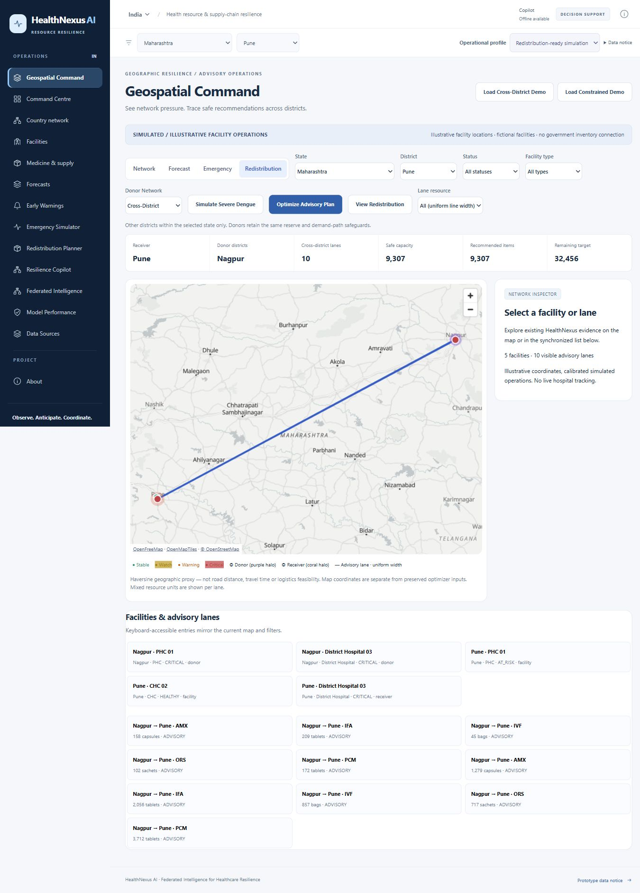

# District computation budget: actual browser captures

Captured from the final Docker frontend/backend on 1 October 2026. These are actual UI flows, not mockups. Provider transport was disabled for this local test. Scenario and optimizer values were recomputed through the UI. Desktop and mobile flows retained profile/geography, visible attribution and simulated/illustrative labels; captured console errors/warnings were empty. Temporary viewport overrides were reset. Manual review is not accessibility certification.

- [National planner: clear district selection, no expensive automatic run](01-national-planner.png)
- [National warnings: clear district selection](02-national-warnings.png)
- [Mobile district-selection notice, 390 x 844](03-mobile-warnings.png)
- [Actual Pune warnings after selecting a district](04-pune-warnings.png)
- [Actual severe 14-day ready-profile dengue simulation](05-ready-emergency.png)
- [Actual district plan: 15,679 items, 10 lanes, 26,084 remaining](06-district-plan.png)
- [Actual cross-district plan: 9,307 items, 10 lanes, 32,456 remaining](07-cross-district-plan.png)
- [Desktop Pune/Nagpur map with actual ten advisory lanes](08-cross-map-desktop.png)
- [Mobile Pune/Nagpur map, 390 x 844](09-cross-map-mobile.png)
- [Actual constrained plan: zero donors/lanes, 30,230 remaining](10-constrained-map.png)
- [Nationwide illustrative network retained, 207 fictional facilities](11-national-network.png)

